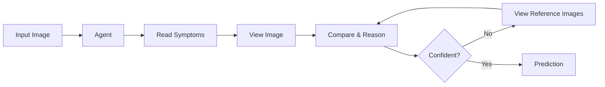
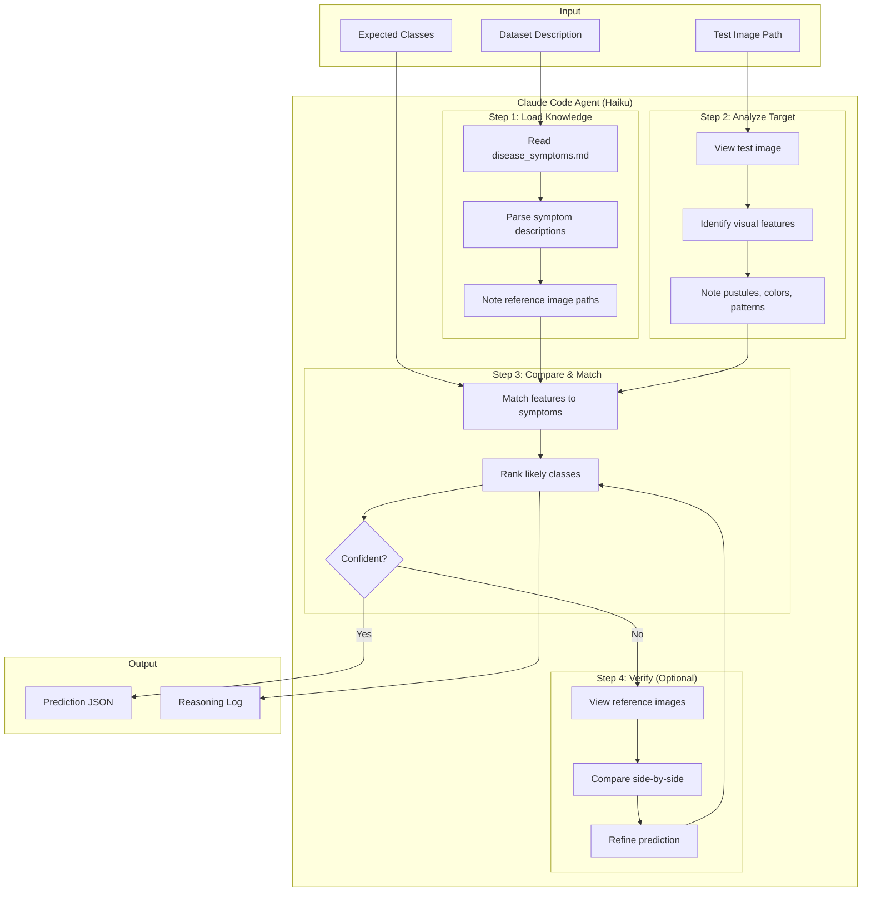
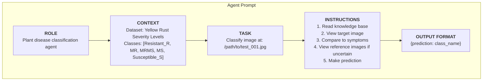
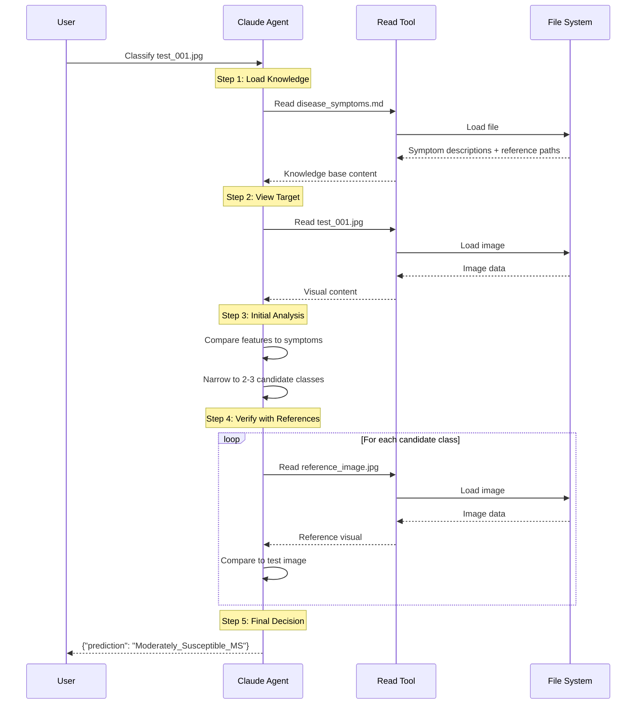
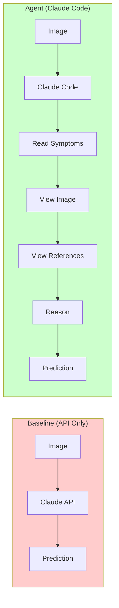

# Agentic Classification Flow

## Simple Version

## Detailed Version

## Prompt Structure

## Tool Usage Flow

## Baseline vs Agent Comparison

| Aspect | Baseline | Agent |
|--------|----------|-------|
| Knowledge | None (zero-shot) | Symptoms + Reference Images |
| Tool Access | No | Read tool |
| Reasoning | Single inference | Multi-step with verification |
| Adaptability | Fixed prompt | Dynamic exploration |
