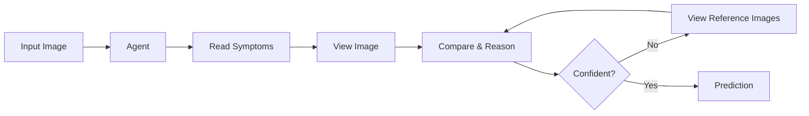
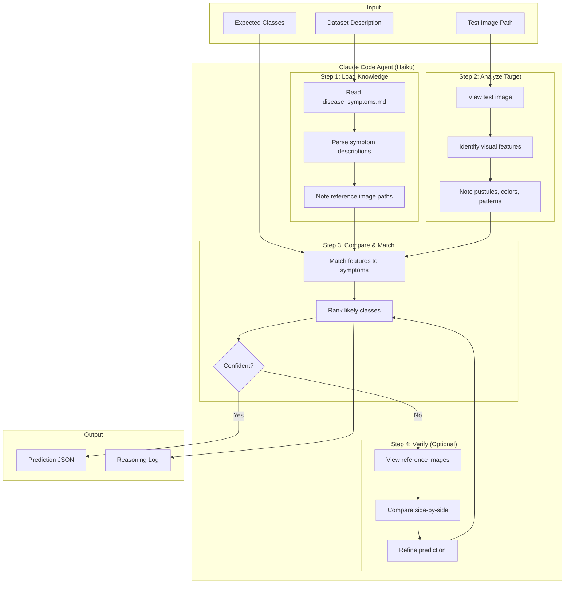
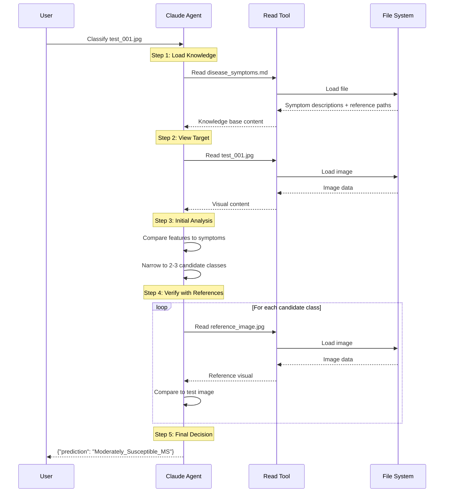
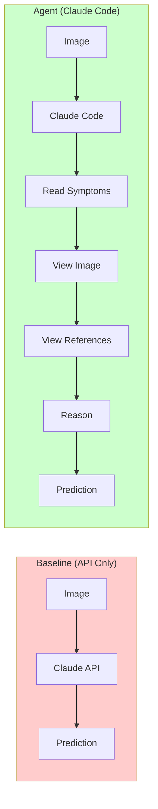

# Plant Disease Classification: Baseline vs Agent

Comparing direct API inference vs Claude Code agentic approach for plant disease classification.

## Datasets

| Dataset | Description | Classes |
|---------|-------------|---------|
| Foliar_Disease_Stress | Mango Leaf Diseases | 7 (Anthracnose, Bacterial_Canker, etc.) |
| Disease_Severity | Yellow Rust in Wheat | 5 (Resistant_R, MR, MRMS, MS, Susceptible_S) |

## Setup

```bash
# Create conda environment
source ~/miniconda3/etc/profile.d/conda.sh
conda create -n vl-reasoning python=3.10 -y
conda activate vl-reasoning

# Install dependencies
pip install anthropic openai python-dotenv
```

## Quick Start

```bash
# 1. Generate symptoms knowledge base (one-time)
python generate_symptoms.py

# 2. Prepare anonymized test data
python prepare_test_data.py --per-class 2

# 3. Run baseline (API only)
python run_baseline.py

# 4. Run agent (Claude Code headless)
python run_agent.py

# 5. Compare results
python evaluate.py
```

## Run Single Agent Example

```bash
claude -p "You are a plant disease classification agent.

DATASET: Yellow Rust Severity Levels
AVAILABLE CLASSES: ['Resistant_R', 'Moderately_Resistant_MR', 'MRMS', 'Moderately_Susceptible_MS', 'Susceptible_S']

TASK: Classify the image at: /path/to/test_001.jpg

INSTRUCTIONS:
1. Read disease_symptoms.md
2. View the target image
3. Compare to symptoms
4. View reference images if uncertain
5. Make prediction

OUTPUT: {\"prediction\": \"class_name\"}" --allowedTools "Read" --model haiku --verbose
```

## Project Structure

```
reasoning/
├── Plant_Disease_Dataset/      # Source images (labeled)
├── test_data/                  # Anonymized test sets
│   ├── Foliar_Disease_Stress/
│   └── Disease_Severity/
├── disease_symptoms.md         # Knowledge base (GPT-generated)
├── results/
│   ├── baseline/               # API predictions
│   └── agent/                  # Agent predictions + logs
├── generate_symptoms.py        # Create knowledge base
├── prepare_test_data.py        # Create anonymized test sets
├── run_baseline.py             # Direct API inference
├── run_agent.py                # Claude Code headless
├── evaluate.py                 # Compare results
├── AGENT_FLOW.md               # Mermaid diagrams
└── PLAN.md                     # Implementation plan
```

## Approach Comparison

| | Baseline | Agent |
|-|----------|-------|
| Method | Direct API call | Claude Code `-p` |
| Knowledge | None | Symptoms + reference images |
| Tools | None | Read |
| Reasoning | Single inference | Multi-step with verification |

---

## Agent Flow Diagrams

### Simple Version



### Detailed Version



### Tool Usage Flow



### Baseline vs Agent




documentatino for headless
```

Run Claude Code programmatically

Copy page

Use the Agent SDK to run Claude Code programmatically from the CLI, Python, or TypeScript.

The Agent SDK gives you the same tools, agent loop, and context management that power Claude Code. It’s available as a CLI for scripts and CI/CD, or as Python and TypeScript packages for full programmatic control.
The CLI was previously called “headless mode.” The -p flag and all CLI options work the same way.
To run Claude Code programmatically from the CLI, pass -p with your prompt and any CLI options:
claude -p "Find and fix the bug in auth.py" --allowedTools "Read,Edit,Bash"
This page covers using the Agent SDK via the CLI (claude -p). For the Python and TypeScript SDK packages with structured outputs, tool approval callbacks, and native message objects, see the full Agent SDK documentation.
​
Basic usage
Add the -p (or --print) flag to any claude command to run it non-interactively. All CLI options work with -p, including:
--continue for continuing conversations
--allowedTools for auto-approving tools
--output-format for structured output
This example asks Claude a question about your codebase and prints the response:
claude -p "What does the auth module do?"
​
Examples
These examples highlight common CLI patterns.
​
Get structured output
Use --output-format to control how responses are returned:
text (default): plain text output
json: structured JSON with result, session ID, and metadata
stream-json: newline-delimited JSON for real-time streaming
This example returns a project summary as JSON with session metadata, with the text result in the result field:
claude -p "Summarize this project" --output-format json
To get output conforming to a specific schema, use --output-format json with --json-schema and a JSON Schema definition. The response includes metadata about the request (session ID, usage, etc.) with the structured output in the structured_output field.
This example extracts function names and returns them as an array of strings:
claude -p "Extract the main function names from auth.py" \
  --output-format json \
  --json-schema '{"type":"object","properties":{"functions":{"type":"array","items":{"type":"string"}}},"required":["functions"]}'
Use a tool like jq to parse the response and extract specific fields:
# Extract the text result
claude -p "Summarize this project" --output-format json | jq -r '.result'

# Extract structured output
claude -p "Extract function names from auth.py" \
  --output-format json \
  --json-schema '{"type":"object","properties":{"functions":{"type":"array","items":{"type":"string"}}},"required":["functions"]}' \
  | jq '.structured_output'
​
Stream responses
Use --output-format stream-json with --verbose and --include-partial-messages to receive tokens as they’re generated. Each line is a JSON object representing an event:
claude -p "Explain recursion" --output-format stream-json --verbose --include-partial-messages
The following example uses jq to filter for text deltas and display just the streaming text. The -r flag outputs raw strings (no quotes) and -j joins without newlines so tokens stream continuously:
claude -p "Write a poem" --output-format stream-json --verbose --include-partial-messages | \
  jq -rj 'select(.type == "stream_event" and .event.delta.type? == "text_delta") | .event.delta.text'
For programmatic streaming with callbacks and message objects, see Stream responses in real-time in the Agent SDK documentation.
​
Auto-approve tools
Use --allowedTools to let Claude use certain tools without prompting. This example runs a test suite and fixes failures, allowing Claude to execute Bash commands and read/edit files without asking for permission:
claude -p "Run the test suite and fix any failures" \
  --allowedTools "Bash,Read,Edit"
​
Create a commit
This example reviews staged changes and creates a commit with an appropriate message:
claude -p "Look at my staged changes and create an appropriate commit" \
  --allowedTools "Bash(git diff *),Bash(git log *),Bash(git status *),Bash(git commit *)"
The --allowedTools flag uses permission rule syntax. The trailing * enables prefix matching, so Bash(git diff *) allows any command starting with git diff. The space before * is important: without it, Bash(git diff*) would also match git diff-index.
User-invoked skills like /commit and built-in commands are only available in interactive mode. In -p mode, describe the task you want to accomplish instead.
​
Customize the system prompt
Use --append-system-prompt to add instructions while keeping Claude Code’s default behavior. This example pipes a PR diff to Claude and instructs it to review for security vulnerabilities:
gh pr diff "$1" | claude -p \
  --append-system-prompt "You are a security engineer. Review for vulnerabilities." \
  --output-format json
See system prompt flags for more options including --system-prompt to fully replace the default prompt.
​
Continue conversations
Use --continue to continue the most recent conversation, or --resume with a session ID to continue a specific conversation. This example runs a review, then sends follow-up prompts:
# First request
claude -p "Review this codebase for performance issues"

# Continue the most recent conversation
claude -p "Now focus on the database queries" --continue
claude -p "Generate a summary of all issues found" --continue
If you’re running multiple conversations, capture the session ID to resume a specific one:
session_id=$(claude -p "Start a review" --output-format json | jq -r '.session_id')
claude -p "Continue that review" --resume "$session_id"
​

```